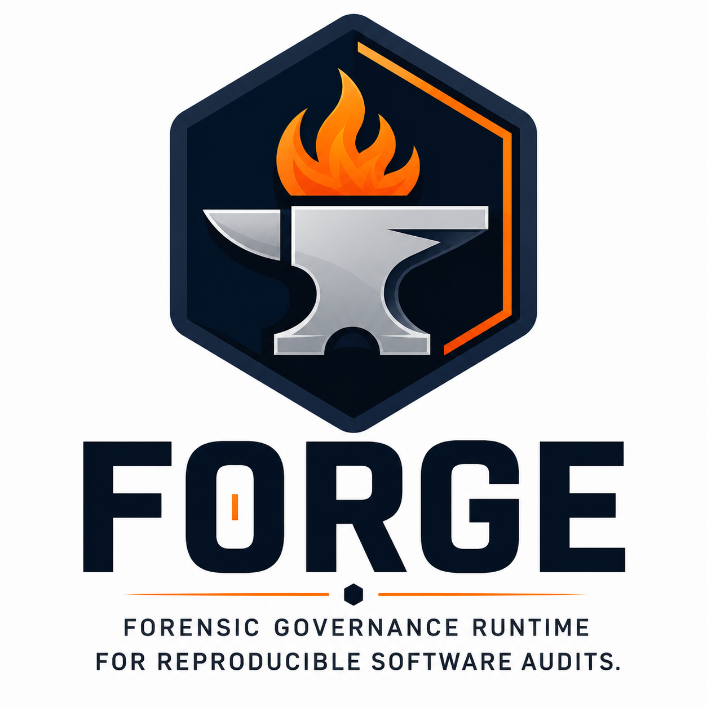
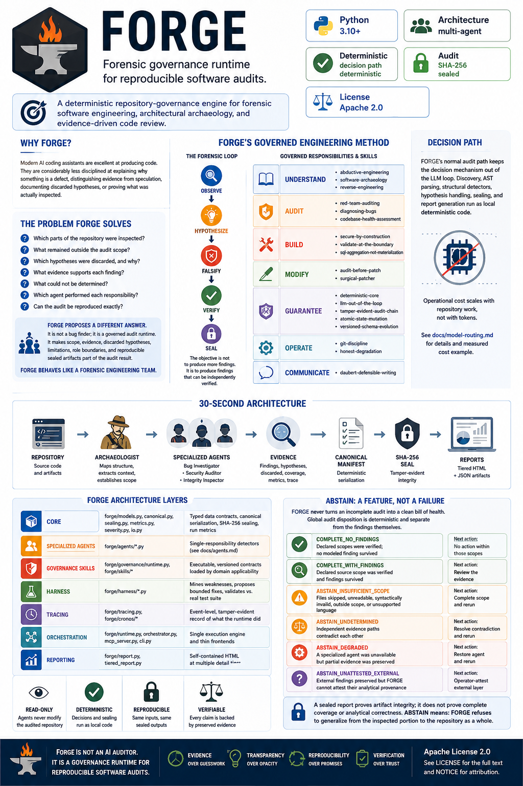
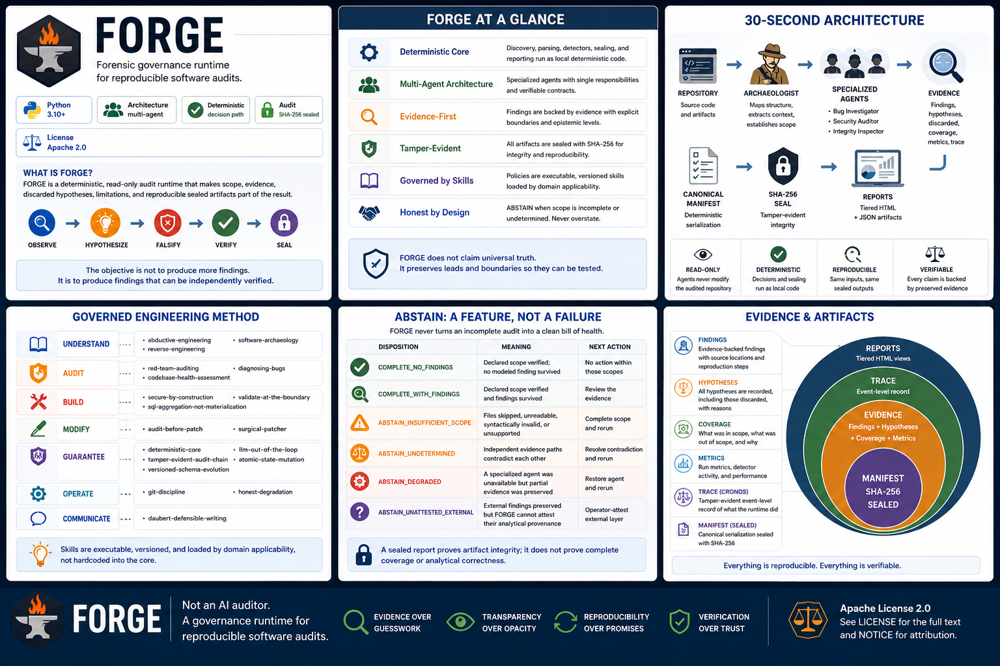
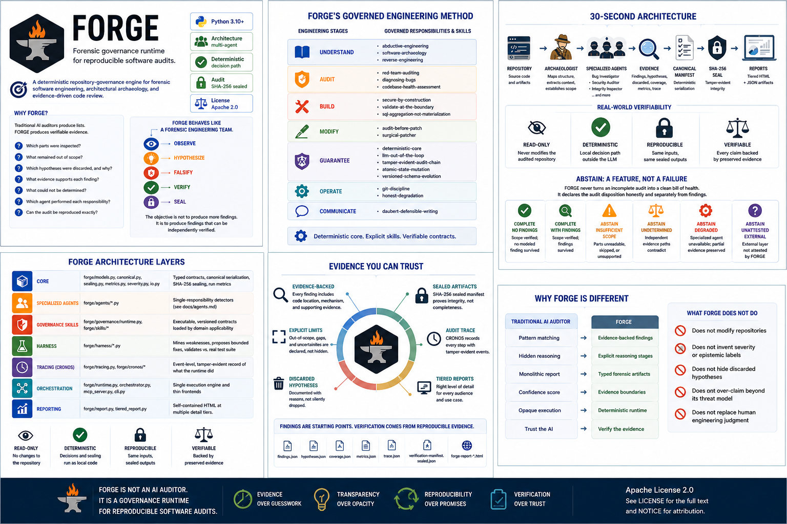
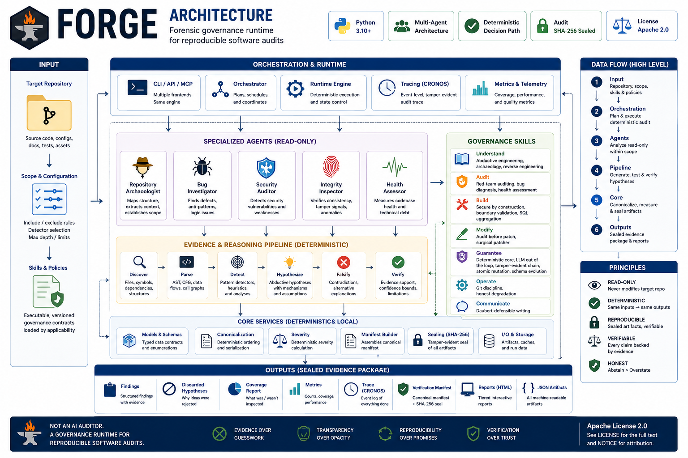

<p align="center">
  
</p>

# FORGE


> **Forensic governance runtime for reproducible software audits.**
>
> A deterministic repository-governance engine for forensic software
> engineering, architectural archaeology, and evidence-driven code review.

**Live** — ▶ [**Preview**](https://forge-preview-lyart.vercel.app) · ▶ [**Technical Companion**](https://forge-technical-companion.vercel.app)

> **Live report views** — ▶ [**Standard**](https://annatchijova.github.io/vigia/forge-report.html) · ▶ [**Extended**](https://annatchijova.github.io/vigia/forge-extended.html)
>
> The rendered HTML reports from a real FORGE audit, in two depths: the
> standard daily-review pass and the extended forensic deep dive.

> **Terminal-first and agent-ready.** One deterministic audit runtime is
> available through the CLI, Python API, and native MCP: agents use a governed
> tool boundary rather than a prompt being treated as audit authority. The core
> audit path is local, read-only, stdlib-only, and needs no API key or network.

## Evidence at hackathon scale

> **Over 800 MB of reproducible audit evidence — approaching a gigabyte.**

`results/` in this repository contains **46 MB** of sealed HTML and JSON audit
artifacts. A further **764 MB** is published in the separate
[`forge-results`](https://github.com/annatchijova/forge-results) archive.

This is an accumulated investigation record, not one or two showcase reports:
self-audits, real-repository case studies, benchmark runs, false positives,
discarded hypotheses, sealed manifests, traces, and regression-backed fixes
remain available for inspection.

### What those numbers mean

The counts below were generated with `cloc` over tracked `.py`, `.md`,
`.json`, `.sql`, and `.html` files on 2026-07-21. They separate the runtime
from the generated evidence it preserves:

| Repository | Tracked files counted | Total lines | Meaning |
|---|---:|---:|---|
| This `forge` repository | 479 | **743,646** | Runtime, tests, documentation, visual reports, and checked-in sealed artifacts |
| [`forge-results`](https://github.com/annatchijova/forge-results) | 563 | **7,868,088** | Separately versioned archive of generated JSON/HTML evidence and audit reports |

The runtime itself contains **11,603 Python LOC**. The rest is not being
presented as implementation code: it is the inspectable corpus of manifests,
reports, traces, false positives, discarded hypotheses, benchmark runs, and
regression evidence that the project has accumulated. The distinction matters.
FORGE is designed to leave an investigation record, not merely print a result.

---

## Why FORGE?

Modern AI coding assistants are excellent at producing code.

They are considerably less disciplined at explaining **why** something is a
defect, distinguishing evidence from speculation, documenting discarded
hypotheses, or proving what was actually inspected.

FORGE addresses that gap.

It is deliberately not a generic “find bugs” wrapper. A detector signal is a
lead with a scope, mechanism, provenance, and uncertainty state. The runtime
must preserve the lead even when it later becomes a false positive, because a
false positive can reveal a different reachable defect — and because silently
rewriting that history would make the audit less trustworthy, not more.

## The problem FORGE solves

Most repository reviews still begin with a prompt such as: “ChatGPT, find
bugs,” or “Codex, audit this repository.” The result is usually a list.

But a list rarely answers the questions a reviewer needs to trust it:

- Which parts of the repository were inspected?
- What remained outside the audit scope?
- Which hypotheses were discarded, and why?
- What evidence supports each finding?
- What could not be determined?
- Which agent performed each responsibility?
- Can the audit be reproduced exactly?

FORGE proposes a different answer. It is not a bug finder; it is a governed
audit runtime. It makes scope, evidence, discarded hypotheses, limitations,
role boundaries, and reproducible sealed artifacts part of the audit result
rather than optional commentary around a list of findings.

> FORGE behaves like a forensic engineering team.

```
Observe
   │
   ▼
Hypothesize
   │
   ▼
Falsify
   │
   ▼
Verify
   │
   ▼
Seal
```

The objective is not to produce more findings. It is to produce findings that
can be independently verified.

## A governance SDK for agent engineering

FORGE captures 20 documented engineering and governance skills as reusable
methods, not prompt templates. They make the runtime's reasoning obligations
inspectable instead of hiding them in a prompt or an agent persona. The current
executable runtime enforces the applicable versioned contracts; the remaining
skills stay explicitly documented as process-level methodology rather than
being misrepresented as scanners.

| Stage | Skills |
|---|---|
| **Understand** | `abductive-engineering`, `software-archaeology`, `reverse-engineering` |
| **Audit** | `red-team-auditing`, `diagnosing-bugs`, `codebase-health-assessment` |
| **Build** | `secure-by-construction`, `validate-at-the-boundary`, `sql-aggregation-not-materialization` |
| **Modify** | `audit-before-patch`, `surgical-patcher` |
| **Guarantee** | `deterministic-core`, `llm-out-of-the-loop`, `tamper-evident-audit-chain`, `atomic-state-mutation`, `versioned-schema-evolution` |
| **Operate** | `git-discipline`, `honest-degradation` |
| **Communicate** | `daubert-defensible-writing` |

FORGE's normal audit path also keeps the decision mechanism out of the LLM
loop: discovery, AST parsing, structural detectors, hypothesis handling,
sealing, and report generation run as local deterministic code, so operational
cost scales with repository work, not with tokens sent to a model. Model
routing is explicit and recorded honestly rather than presented as evidence
that a model ran. See [`docs/model-routing.md`](docs/model-routing.md) for the
full configuration and a measured cost example.

---

## Dogfooding case study: FORGE found a real bug in itself

Dogfooding isn't a slide, it's a run. Auditing the maintainer's own
`vigia-repo` (a repository FORGE had never seen) hung indefinitely instead of
completing. Root cause: an infinite loop in FORGE's own Integrity Inspector,
triggered by an entirely ordinary pattern — a variable reassigned with a
different `float()` call in each branch of an `if`/`else`. Fixed, with a
regression test: the same audit now completes in **~2.5 seconds instead of
hanging past a 280-second timeout**. The corrected audit also surfaced real
findings in the audited repository itself, including a probability returned as
a raw `float()` from a model prediction inside a function literally named
`calibrated_posterior()`.

Full writeup and all three run artifacts (JSON + HTML) in
[`annatchijova/forge-results`](https://github.com/annatchijova/forge-results#highlight-dogfooding-runs-that-found-a-real-forge-bug-2026-07-16).

---

## Real-world evidence: a finding is a starting point, not a verdict

FORGE does not claim universal truth, nor does a sealed finding become a
confirmed defect merely because it was emitted. Its job is to make the lead
reproducible: preserve the exact source location, scope, mechanism, and limits
so a reviewer can test what the detector could not decide.

Two read-only audits of [VIGÍA](https://github.com/annatchijova/vigia-intent-analysis)
show why that boundary is useful:

- In the first run, a contextual FORGE false positive was not discarded as
  noise. Reviewing its surrounding mechanism led to a separate, complex,
  reachable defect. That defect was independently verified, fixed, committed,
  and pushed in VIGÍA. FORGE's original signal remains a lead, not a
  retroactively rewritten "true positive".
- In the later breadth audit, the executable `honest-degradation` skill exposed
  several silent-evidence-loss paths. One induced experiment demonstrated a
  live decision flip: normalization silently erased a malformed artifact's
  temporal assertion, turning a `SUSPICION` result into `NOISE` without a
  coverage marker. Other candidates were classified honestly as false
  positives, component-level gaps, or still-unresolved reachability questions.
- A subsequent investigation followed FORGE's deterministic lead in CAIE's
  timestamp-parse path. FORGE did not prove the defect: a human/agent built a
  controlled valid-versus-unparseable timestamp pair and established that a
  real temporal-causality fracture disappeared, while the sealed pipeline
  changed from `SUSPICION` (`0.4549`) to `NOISE` (`0.0192`) with no coverage
  marker. The target fix is therefore evidence-preservation plus abstention,
  not a detector verdict being relabeled after the fact.

That is the intended workflow: deterministic detection narrows the search;
human or agent adjudication traces callers and executes bounded experiments;
only then are defects fixed in the target repository. Full provenance,
including false positives and current limits, is in the
[`VIGÍA breadth-audit record`](docs/vigia-honest-degradation-breadth-2026-07-17.md)
and the [real-repository case studies](docs/real-repository-case-studies.md).

---

## 30-second architecture

```
Repository
   │
   ▼
Archaeologist
   │
   ▼
Specialized agents  (Bug Investigator · Security Auditor · Integrity Inspector)
   │
   ▼
Evidence
   │
   ▼
Canonical Manifest
   │
   ▼
SHA-256 Seal
   │
   ▼
Reports
```


FORGE is not a single script that scans a repository and prints findings. It
is a small set of layers, each with one job, composed by one runtime:

| Layer | Lives in | Responsibility |
|---|---|---|
| **Core** | `forge/models.py`, `canonical.py`, `sealing.py`, `metrics.py`, `severity.py`, `io.py` | Typed data contracts, canonical serialization, SHA-256 sealing, run metrics |
| **Specialized agents** | `forge/agents/*.py` | Single-responsibility detectors — see [`docs/agents.md`](docs/agents.md) |
| **Governance skills** | `forge/governance/runtime.py`, `forge/skills/*` | Executable, versioned contracts loaded by domain applicability, not hardcoded into the core |
| **Harness** | `forge/harness/*.py` | Mines weaknesses from sealed runs, proposes bounded fixes, validates against the real test suite |
| **Tracing** | `forge/tracing.py`, `forge/cronos/*` | Event-level, tamper-evident record of what the runtime *did*, sealed alongside findings |
| **Orchestration** | `forge/runtime.py`, `orchestrator.py`, `mcp_server.py`, `cli.py` | The single execution engine and its thin frontends |
| **Reporting** | `forge/report.py`, `tiered_report.py` | Self-contained HTML at multiple detail tiers |

No agent reasons on another agent's behalf, and the orchestrator does not
delegate open-ended judgment to anything: each agent has a verifiable
responsibility and an explicit contract. Full agent-by-agent breakdown and
diagram in [`docs/agents.md`](docs/agents.md).

---

## Repository map

This is the implementation tree, intentionally excluding generated caches,
archived run payloads, and the visual gallery (see [Visual walkthrough](#visual-walkthrough)
near the end). The full evidence archive remains under [`results/`](results/).

```text
forge/
├── .github/workflows/        # CI
├── agents/                   # concise public agent overview
├── docs/                     # contracts, methodology, red-team records, guides
│   └── images/               # documentation assets
├── forge/                    # Python implementation
│   ├── agents/               # bounded specialist detectors
│   ├── cronos/               # trace chain, store, quality, narration
│   ├── detector/             # discovery and detector-scope stack
│   ├── governance/           # executable governance runtime
│   ├── harness/              # bounded self-improvement and validation
│   ├── skills/               # executable domain contracts
│   ├── cli.py                # CLI frontend
│   ├── mcp_server.py         # MCP frontend
│   ├── multi_agent.py        # external work-product validation
│   ├── orchestrator.py       # compatibility frontend
│   ├── runtime.py            # one canonical audit runtime
│   ├── sealing.py            # manifests and integrity seals
│   └── verification.py       # independent verification
├── results/                  # preserved, sealed audit evidence
├── skills-gpt/               # human-readable governance skill material
├── tests/                    # unit, integration, corpus, recall and hardening tests
│   └── corpus/               # positive, negative, and out-of-scope fixtures
├── visual/                   # README run and report screenshots
├── CODEX.md                  # collaboration contract
├── DECISIONS.md              # architectural decision record
├── pyproject.toml            # packaging and test configuration
└── README.md
```

---

## Installation

FORGE's core audit path uses only the Python standard library. Python 3.10 or
newer is required.

```bash
git clone https://github.com/annatchijova/forge.git
cd forge
python3 -m venv .venv
. .venv/bin/activate
python -m pip install --upgrade pip
python -m pip install -e .
```

The commands are cross-platform; only virtual-environment activation differs by
shell:

**Windows PowerShell**

```powershell
git clone https://github.com/annatchijova/forge.git
Set-Location forge
py -3 -m venv .venv
.\.venv\Scripts\Activate.ps1
python -m pip install --upgrade pip
python -m pip install -e .
```

**Windows Command Prompt**

```bat
git clone https://github.com/annatchijova/forge.git
cd forge
py -3 -m venv .venv
.venv\Scripts\activate.bat
python -m pip install --upgrade pip
python -m pip install -e .
```

On macOS, use the Unix block above. If `python3` is not installed, install a
current Python 3.10+ distribution first; on Windows, `py -3` selects the
Python launcher explicitly.

The optional MCP frontend can be installed with `python -m pip install -e
".[mcp]"`. The core CLI does not require model credentials or third-party
packages.

## Quick start

```text
Deterministic
Read-only
Reproducible
```

```bash
python3 -m forge audit /path/to/repository -o forge-run --max-connected 100
```

or from Python:

```python
from forge import Runtime
result = Runtime().audit("/path/to/repository", "forge-run")
```

Every audit produces a full evidence package in the output directory —
findings, discarded hypotheses, coverage report, sealed manifest, and a
self-contained HTML report.

Supports:

* CLI
* Python API
* MCP (see [`docs/mcp.md`](docs/mcp.md))
* The backward-compatible orchestrator entry point

Full frontend reference, large-repository demo mode, and the reproducible
benchmark corpus command are in [`docs/runtime.md`](docs/runtime.md).

Outputs:

* Interactive HTML report
* JSON artifacts (triage, hypotheses, findings, coverage, metrics, trace)
* SHA-256 sealed verification manifest

### Which report should I use?

An audit writes one evidence set and several views over it. The views do not
recompute findings; choose the one that matches the reader and the question.

| Open this | Use it for |
|---|---|
| `forge-report.html` | The interactive dashboard: best first view for a demo, a broad review, or a reader new to FORGE. |
| `forge-report-summary.html` | A fast, shareable status view when someone needs the result and boundaries without the full audit detail. |
| `forge-report-standard.html` | The normal daily-review report: overview, severity, grouped related findings, source locations, reproduction commands, discarded hypotheses, and coverage. |
| `forge-report-extended.html` | A forensic deep dive: use when reviewing reasoning chains, governance contracts, and the audit trace. |
| `forge-report-shards.html` | Navigation index for a bounded audit split into independently sealed shards; it never fabricates a parent seal. |
| `verification-manifest.sealed.json` | Machine-readable evidence for MCP, automation, or independent verification — not the first file a human reviewer should open. |

For an everyday engineering workflow, start with **standard**. Use the
interactive dashboard to orient a new reviewer, and use **extended** only
when the evidence needs to be examined in depth.

Details on why artifacts are split rather than nested into one blob, and on
what the seal does and does not prove, in [`docs/artifacts.md`](docs/artifacts.md).

For a sharded run, render the presentation index directly from the run
directory:

```bash
python3 -m forge report /path/to/forge-run
```

The index links each shard's own `summary`, `standard`, and `extended` reports.
Each shard remains an independent sealed evidence set; the index is only a
human-friendly map across them.

Historical audit and benchmark runs — including full findings, discarded
hypotheses, and known false positives — are kept out of this checkout and
published at
[`annatchijova/forge-results`](https://github.com/annatchijova/forge-results)
so anyone can browse past evidence without cloning large run artifacts.

---

## Why is FORGE different?

| Traditional AI auditor | FORGE |
|---|---|
| Pattern matching | Evidence-backed findings |
| Hidden reasoning | Explicit reasoning stages |
| Monolithic report | Typed forensic artifacts |
| Confidence score | Evidence boundaries |
| Opaque execution | Deterministic runtime |
| Trust the AI | Verify the evidence |

---

## Engineering philosophy

FORGE follows an abductive engineering workflow:

> Observation → Abduction → Deduction → Induction.

Evidence stays separate from inference throughout the pipeline; every finding
carries an explicit epistemic level (CODE FACT, PLAUSIBLE HYPOTHESIS, CONFIRMED
BY INDUCTION, FALSIFIED) that is never conflated with severity. Full vocabulary
and design principles in [`docs/philosophy.md`](docs/philosophy.md).

Governance policies (security, determinism, provenance, and more) are
implemented as executable, versioned skills loaded by domain applicability,
not hardcoded into the core. See [`docs/skills.md`](docs/skills.md).

Runtime tracing is powered by an internal CRONOS engine — see
[`docs/cronos.md`](docs/cronos.md).

---

## ABSTAIN: a feature, not a failure

FORGE never turns an incomplete audit into a clean bill of health. The global
audit disposition is deterministic and separate from the findings themselves:

| Disposition | Meaning | Next action |
|---|---|---|
| `COMPLETE_NO_FINDINGS` | Declared source and detector scopes were verified; no modeled finding survived | No action within those scopes |
| `COMPLETE_WITH_FINDINGS` | Declared source scope was verified and findings survived | Review the evidence |
| `ABSTAIN_INSUFFICIENT_SCOPE` | Source files were skipped, unreadable, syntactically invalid, outside scope, or in an unsupported language | Complete the scope and rerun |
| `ABSTAIN_UNDETERMINED` | Independent evidence paths contradict each other | Resolve the contradiction and rerun |
| `ABSTAIN_DEGRADED` | A specialized agent was unavailable but partial evidence was preserved | Restore the agent and rerun |
| `ABSTAIN_UNATTESTED_EXTERNAL` | External findings were preserved but FORGE cannot attest their analytical provenance | Review and explicitly operator-attest the external layer before relying on it as an audit result |

`ABSTAIN` does not erase findings. It says that FORGE refuses to generalize
from the inspected portion to the repository as a whole. A sealed report
proves artifact integrity; it does not prove complete coverage or analytical
correctness. In a multi-agent closeout, assembly attestation and each layer's
analytical provenance are separate claims: an attested canonical artifact can
still contain an explicitly `UNATTESTED` external layer and must abstain. See
[`docs/seal-authentication.md`](docs/seal-authentication.md) and
[`docs/vigia-inspired-governance.md`](docs/vigia-inspired-governance.md)
for the design rationale and [`DECISIONS.md`](DECISIONS.md) for the contract.

---

## What FORGE does not do

FORGE intentionally does **not**:

* rewrite repositories automatically — every agent is read-only against the
  audited repository
* invent severity or epistemic labels — `epistemic_level` is drawn from a
  fixed vocabulary and never conflated with the `category` field
* hide discarded hypotheses — they are rendered in the report with their
  discard reason, not silently dropped
* convert an AST pattern match into a claim about runtime behavior it did not
  observe
* claim cryptographic guarantees beyond its documented threat model — the
  seal is tamper-evident, not tamper-proof, and says so
* replace human engineering judgment

---

## Documentation

**Architecture**
* [`docs/runtime.md`](docs/runtime.md) — frontends, demo mode, benchmark corpus
* [`docs/agents.md`](docs/agents.md) — full agent-by-agent breakdown
* [`docs/seeded-recall-corpus.md`](docs/seeded-recall-corpus.md) — modeled-family recall, benign twins, and explicit out-of-scope limits
* [`docs/recall-gap-closure-lot-1.md`](docs/recall-gap-closure-lot-1.md) — measured variant-recall improvements and retained detector boundaries
* [`docs/recall-gap-closure-lot-2.md`](docs/recall-gap-closure-lot-2.md) — SQL and command injection recall closure

**Evidence**
* [`docs/artifacts.md`](docs/artifacts.md) — output artifacts and sealing
* [`docs/seal-authentication.md`](docs/seal-authentication.md) — optional HMAC authentication for sealed artifacts and key handling
* [`docs/model-routing.md`](docs/model-routing.md) — model routing and the measured cost advantage

**Governance**
* [`docs/skills.md`](docs/skills.md) — governance skill catalog and extensibility
* [`docs/cronos.md`](docs/cronos.md) — the internal CRONOS tracing engine
* [`docs/philosophy.md`](docs/philosophy.md) — the Peircean reasoning loop and design principles

**Build**
* [`docs/mcp.md`](docs/mcp.md) — MCP tools and Claude Code integration
* [`docs/hackathon.md`](docs/hackathon.md) — build notes and Codex session evidence
* [`docs/hackathon-demo-script.md`](docs/hackathon-demo-script.md) — three-to-five minute judge demo script
* [`docs/codex-terminal-prompts.md`](docs/codex-terminal-prompts.md) — copy-paste Codex prompts for read-only FORGE + CRONOS runs
* [`docs/real-repository-case-studies.md`](docs/real-repository-case-studies.md) — public Stylometry and Vigia adjudication case studies
* [`docs/vigia-honest-degradation-breadth-2026-07-17.md`](docs/vigia-honest-degradation-breadth-2026-07-17.md) — read-only VIGÍA breadth audit: adjudicated signal, FP, FN, and scope boundary
* [`docs/vigia-full-battery-2026-07-17.md`](docs/vigia-full-battery-2026-07-17.md) — full detector-family harvest over a declared VIGÍA production scope, with sealed-run inventory and adjudication boundaries
* [`docs/technical-companion.html`](docs/technical-companion.html) — bilingual interactive technical companion for reviewers

**Reference**
* [`DECISIONS.md`](DECISIONS.md) — recorded architectural decisions and their boundaries
* [`agents/README.md`](agents/README.md) — agent role contracts
* [`annatchijova/forge-results`](https://github.com/annatchijova/forge-results) — historical audit/benchmark runs, findings, and false positives

Run all commands (`pytest`, `python3 -m forge`, and Git operations) from the
repository root: `/home/labestiadevigia/forge`. Running from a parent
directory can pick up unrelated files and produce misleading test or audit
results.

---

## Vision

> FORGE is not an AI auditor.
>
> It is a governance runtime for reproducible software audits.

The differentiator is not the detector. "FORGE finds bugs with AI" describes
a script. What FORGE actually is: a governance runtime for reproducible
audits, where the detector is one replaceable layer among several — agents,
governance skills, a sealed trace, tiered reporting — each with its own
verifiable contract. That is the difference between "an auditor" and a
platform where the audits themselves are traceable, reproducible, and
governed by contracts.

---

## Visual walkthrough

<p align="center">
  
  
  
  
</p>

### Four execution modes — CORVUS × CRONOS

The same read-only audit baseline was exercised through CLI, the Python API,
MCP, and the orchestrator against
[Wolf & CRONOS](https://github.com/annatchijova/wolf-and-cronos). The
screenshots preserve the run trail and the follow-up adjudication.

**CLI** — the audit run from the command line, then its sealed output verified:

<p align="center">
  
  
</p>

**Python API** — the same audit run programmatically:

<p align="center">
  
</p>

**Orchestrator** — the backward-compatible entry point, sharded and shard-verified:

<p align="center">
  
  
</p>

**MCP** — the same baseline driven as an MCP tool: audit, artifacts, findings, verification, and the multi-agent canonical result:

<p align="center">
  
  
  
  
  
  
</p>

**The follow-up adjudication** — the four-mode run trail and the post-audit review that separated confirmed anomalies from expected false positives:

<p align="center">
  
  
  
</p>

### Native HTML reports

The self-contained interactive dashboard, walked through view by view:

<p align="center">
  
</p>

<details>
<summary>15 more views of the same report — severity, findings, coverage, trace (click to expand)</summary>
<br/>
<p align="center">
  
  
  
  
  
  
  
  
  
  
  
  
  
  
  
</p>
</details>

*(Live report view links are at the top of this README, next to Preview and Technical Companion.)*

---

## License

Licensed under the Apache License, Version 2.0. See [LICENSE](LICENSE) for
the full text and [NOTICE](NOTICE) for attribution.

---

## Anthem — *FORGE*

*by [Olga Vasilieva](https://suno.com/song/fe41e51b-4207-4555-a6f7-25cb69851656)*

Open the code, let the silence speak,
Every hidden branch, every missing link.
No lucky guesses, no smoke, no disguise,
Only what the evidence justifies.

We don't chase shadows, we don't pretend,
Every trail is followed to the very end.
Question the pattern, challenge the claim,
Truth is earned—not assumed by name.

**(Pre-Chorus)**

Observe...
Hypothesize...
Break it apart to verify.
If it survives, let the record show;
If it falls, we let it go.

**(Chorus)**

FORGE!
Trust the evidence, not the noise.
Every finding has a proven voice.
FORGE!
Built to verify, built to explain.
Every answer leaves a trace.
Seal the truth with SHA-256—
Nothing hidden, nothing missed.

**(Verse 2)**

Many can search, many can scan,
Few can explain exactly what they found.
Scope is visible, limits are clear,
Every conclusion is engineered.

Agents working side by side,
One clear purpose, one defined role.
Read-only eyes, deterministic core,
Reproducible forevermore.

**(Verse 3)**

Every action leaves a trace,
Every artifact has its place.
Nothing hidden, nothing guessed,
Every outcome stands the test.

From the first step to the seal,
Every record stays for real.
Built to verify each node—
Evidence becomes the code.

**(Bridge)**

Observe.
Hypothesize.
Falsify.
Verify.
Seal.

Not "Believe me."
"Check the proof."

**(Final Chorus)**

FORGE!
Trust the evidence, not the noise.
Every finding has a proven voice.
FORGE!
Transparent from the start to the end.
Every artifact can stand again.
Audit the future, protect the code.
Truth is the only road.
FORGE!
